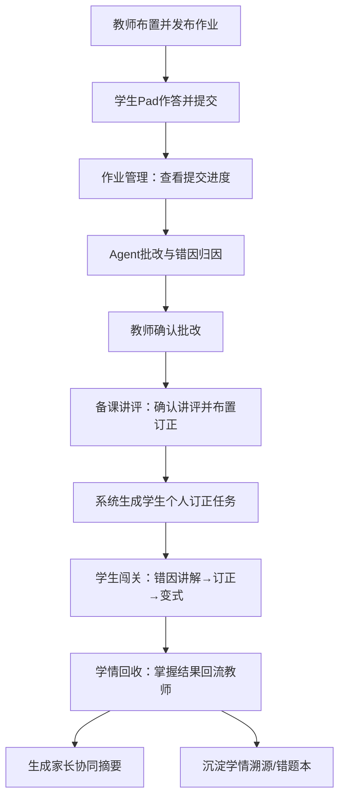

# 真学会 LearnLoop 项目背景预研

> 本文档用于沉淀黑客松项目的背景预研内容，重点回答：创意从哪里来、解决什么真实问题、目标用户是谁、为什么需要新的 Agent 方案，以及该方向的预期价值。  
> **文档索引**：[00-文档索引](./00-真学会%20LearnLoop-文档索引.md) · **Loop 架构**：[02](./02-真学会%20LearnLoop-产品定义与Loop架构说明.md) · **PRD**：[03](./03-真学会%20LearnLoop-产品PRD-V1.md) · **内容域**：[06](./06-真学会%20LearnLoop-MVP内容域定义（一次函数）.md) · **交付排期**：[07](./07-真学会%20LearnLoop-黑客松交付与排期分工.md)

---

## 1. 一句话定义

**真学会 LearnLoop** 是一款面向中小学作业与测验场景的作业后 AI 学习闭环产品：基于同一份作业数据，为教师生成讲评与分层干预方案，为学生生成错因讲解、订正任务与针对性补练，并为家长提供可理解的协同摘要，让一次作业从“批完”真正走向“真学会”。

主 Slogan：

> 批完不算完，真学会才算。

副 Slogan：

> 一份作业，老师知道怎么讲，学生知道怎么会，家长知道怎么配合。

核心主张：

> 本项目不是再做一个 AI 批改、错题本或拍题工具，而是围绕中小学最高频的作业和小测场景，构建连接教师、学生与家长的作业后学习闭环。它基于同一份作业数据，为老师生成讲评和干预方案，为学生生成错因讲解、订正任务和补练路径，并为家长提供可理解的协同摘要，让一次作业真正从“批完”走向“真学会”。

---

## 2. 创意背景

### 2.1 创意来源

在中小学日常教学中，作业、练习和小测是最高频的教学评价场景。一次作业表面上只是“老师布置、学生完成、老师批改、学生订正”，但本质上，它同时承载三类价值：

- 对老师来说，它是判断班级掌握情况、准备讲评和调整教学的依据。
- 对学生来说，它是发现自身薄弱点、完成订正和巩固掌握的入口。
- 对家长来说，它是理解孩子学习状态、进行家庭协同的线索。

但在真实流程中，这三类价值往往没有被连续释放。作业被批改后，结果通常停留在分数、红笔痕迹和零散错题中。老师需要靠经验判断“下节课讲什么”，学生需要自己理解“我为什么错”，家长只能从分数和老师评语里猜测“孩子到底哪里有问题”。

也就是说，当前问题不是学校没有作业，也不是老师不批改、学生不订正，而是：

> 一次作业产生的学习事实，没有自动转化为老师的教学动作、学生的学习路径和家长的协同建议。

过去的产品多按单点功能解决问题：批改工具解决判分，题库解决练习，错题本解决记录，家校沟通工具解决通知。但这些工具之间割裂，导致同一份作业数据在不同角色之间无法自然流动。

随着多模态识别、大模型诊断、Agent 多步规划、长期记忆和 Skill 编排能力成熟，我们有机会重新设计作业后的反馈链路：让 Agent 不只是完成一个功能，而是围绕一次作业自动完成“识别、批改、诊断、讲评、订正、补练、追踪、协同”的连续任务。

### 2.2 想解决的真实问题

可以将核心问题拆解为：

```text
作业没有真正促进学习闭环
├── 老师侧：批完但难以快速形成教学动作
│   ├── 不知道哪些题最值得讲
│   ├── 不知道哪些错因是班级共性
│   └── 不知道哪些学生需要单独跟进
├── 学生侧：订正但不一定真正掌握
│   ├── 知道答案但不知道为什么错
│   ├── 看懂解析但换题仍然不会
│   └── 错题本记录了题，却没有记录错因和掌握状态
├── 家长侧：关心但难以有效协同
│   ├── 只能看分数和排名
│   ├── 不知道孩子具体卡在哪里
│   └── 容易变成催促、加题或盲目报班
└── 系统侧：同一份学习数据没有被复用
    ├── 批改数据没有进入学生学习路径
    ├── 学生订正结果没有反馈给老师
    └── 家校沟通缺少共同事实基础
```

收敛成一句话：

> 作业场景中的核心断点，不是“有没有批改”，而是“批改后的结果没有自动生成下一步行动”。

### 2.3 为什么值得做

| 判断维度 | 具体说明 |
| --- | --- |
| 高频刚需 | 作业、小测、订正几乎每天发生，是中小学最稳定的学习场景。 |
| 双端价值明确 | 老师侧有减负和教学质量诉求，学生侧有提分和掌握诉求，家长侧有付费和协同诉求。 |
| 现有方案割裂 | 批改、错题、题库、家校沟通各自独立，缺少围绕同一份作业数据的闭环。 |
| Agent 适配度高 | 该流程天然包含多步任务、角色分发、人机确认和长期记忆，适合 Agentic 工作流。 |
| 商业化路径灵活 | 可从学校/老师端切入获取高质量数据，也可从学生/家长端形成 C 端学习服务。 |

相比“纯教师批改工具”和“纯学生错题工具”，双端闭环更适合作为黑客松项目方向：

- 纯教师端容易被理解为提效工具，商业想象偏 B 端采购。
- 纯学生端容易被理解为拍题搜答案，竞争激烈且容易浅。
- 双端闭环可以讲成一个新的产品范式：同一份学习数据，被 Agent 自动转译成不同角色的下一步任务。

---

## 3. 目标用户 / 使用对象

### 3.1 核心用户结构

建议用“一主线、三角色”理解本项目，而不是平均展开所有角色。

| 角色 | 产品定位 | 核心诉求 | 本期权重 |
| --- | --- | --- | --- |
| 教师 | 闭环发起者、专业判断者 | 快速完成诊断，知道下节课怎么讲、谁要跟进 | 高 |
| 学生 | 闭环执行者、学习受益者 | 知道为什么错，怎么订正，如何确认掌握 | 高 |
| 家长 | 协同支持者、潜在付费者 | 看懂孩子问题，知道如何低成本配合 | 中 |
| 备课组 / 学校 | 组织复盘者 | 汇总共性问题，沉淀教学资产 | 低，作为愿景 |

### 3.2 目标用户定义

本作品主要面向：

> 中小学作业与小测场景中的学科教师和学生，并通过家长摘要形成家庭侧协同。

首期建议聚焦：

> **初中数学 · 八年级 · 一次函数**章节，覆盖「布置作业 → 作答 → 批改 → 讲评 → 订正 → 掌握回流」完整闭环（详见 [03 PRD §6](./03-真学会%20LearnLoop-产品PRD-V1.md)）。

建议聚焦该范围的原因：

- 错因已收敛为 **5 大类封闭枚举** + AI 生成描述（见 [06 内容域 §2](./06-真学会%20LearnLoop-MVP内容域定义（一次函数）.md)）。
- 学生和家长对提分感知强。
- 老师端讲评和学生端补练都很高频。
- Demo 容易展示从作业数据到双端任务的完整链路。

---

## 4. 使用场景

### 4.0 场景零：作业布置与学生作答（链路起点）

针对【学科教师 + 学生】，在【一次作业从开始到回收作答】，为了解决【后续 AI 诊断缺少可信数据来源】的问题，提供【作业布置、学生作答提交、作业管理查看进度】能力。

典型流程：

```text
老师布置/发布作业（含标准答案与知识点）
→ 学生在 Pad 完成作业并提交
→ 老师在「作业管理」查看提交进度
→ 触发 AI 批改与错因归因
```

### 4.1 场景一：老师批改后准备讲评

针对【学科教师】，在【作业管理确认提交并 AI 批改后】，为了解决【批完后不知道优先讲什么、哪些学生要跟进】的问题，提供【班级错因诊断、讲评重点生成、分层干预建议】能力。

典型流程：

```text
AI 批改完成（错因大类 + 描述 + 知识点）
→ 老师复核确认批改
→ 查看班级学情与讲评建议
→ 确认讲评，布置订正
→ 系统按学生错因分发订正任务
```

### 4.2 场景二：学生收到个人订正任务

针对【学生】，在【老师完成作业诊断后】，为了解决【只知道错了但不知道为什么错、怎么改】的问题，提供【个人错因解释、分步订正引导、针对性补练】能力。

典型流程：

```text
学生打开个人任务
→ 查看本次错题和错因
→ Agent 用学生视角讲解
→ 学生完成订正
→ Agent 给出 2-3 道变式补练
→ 记录掌握状态
```

### 4.3 场景三：老师查看订正与补练反馈

针对【学科教师】，在【学生完成订正和补练后】，为了解决【不知道讲评后学生是否真的掌握】的问题，提供【订正完成情况、二次错误分析、需继续跟进名单】能力。

典型流程：

```text
学生完成补练
→ Agent 汇总掌握情况
→ 标记已掌握 / 仍薄弱 / 需面批学生
→ 老师调整下一轮教学或个别辅导
```

### 4.4 场景四：家长查看学习协同摘要

针对【家长】，在【孩子完成作业订正或阶段复盘后】，为了解决【只看到分数，不知道孩子具体问题和家庭如何配合】的问题，提供【可理解的学情摘要和家庭配合建议】能力。

典型输出：

```text
本周主要问题：一次函数图像理解不稳定
主要错因：能代公式，但不能根据图像判断变化关系
建议配合：今晚不需要额外加题，可让孩子用自己的话解释 2 道图像题的变化关系
```

---

## 5. 现有方案以及为什么需要新的 Agent 方案

### 5.1 现有做法对比

| 现有方案 / 做法 | 优点 | 问题 / 不足 | 新 Agent 方案可以带来的变化 |
| --- | --- | --- | --- |
| 教师人工批改 + 课堂讲评 | 灵活，符合真实教学流程，教师有专业判断 | 耗时重；讲评依据多依赖经验；批改结果难以沉淀到学生个人路径 | Agent 辅助结构化诊断，教师确认后自动生成讲评和学生任务 |
| 在线作业 / 智慧作业平台 | 能完成布置、提交、部分自动批改和统计 | 多停留在分数和正确率；学生端订正与补练弱；角色间数据流转不足 | 从作业管理升级为作业后的教学与学习闭环 |
| 拍题搜答案工具 | 学生获取答案快 | 容易跳过思考；不知道学生自身错因；与老师作业数据割裂 | 学生基于真实作业结果获得错因讲解和订正路径 |
| 错题本 / 错题 App | 能沉淀错题，便于复习 | 记录成本高；只存题，不存错因；缺少老师侧诊断来源 | 自动从作业结果生成个人错因本和掌握状态 |
| 题库刷题产品 | 题量丰富，适合训练 | 容易盲目刷题；练习与本次错误不一定匹配 | 根据真实错因生成少量精准变式补练 |
| 家校沟通工具 | 通知触达方便 | 家长看到的是结论和提醒，不知道如何有效协同 | 把学情转译为家长听得懂、做得到的建议 |

### 5.2 为什么需要 Agent，而不是再做一个功能模块

传统产品通常把流程拆成多个模块：

```text
批改工具
错题本
题库
报表
家校沟通
```

但真实用户的问题不是缺某一个模块，而是这些模块之间缺少连续性。

Agent 的价值在于，它可以围绕一个教学目标自动拆解和执行多步任务：

```text
理解本次作业目标
→ 识别题目与作答
→ 完成批改与归因
→ 生成教师讲评建议
→ 生成学生订正路径
→ 分发补练任务
→ 汇总掌握反馈
→ 生成家长协同摘要
```

因此，新方案的本质不是“AI 批改更快”，而是：

> Agent 把同一份作业数据转译成不同角色的下一步行动。

---

## 6. 解决方案

### 6.1 解决方案简介

本作品是一款面向中小学作业与测验场景的 **真学会 LearnLoop**。

它以一次作业或小测为入口，基于同一份题目、作答和批改数据，自动完成题目结构化、作答识别、错因诊断、讲评建议、个人订正、针对性补练和家长协同摘要。

产品不是单点的 AI 批改工具，也不是学生独立使用的搜题工具，而是一个连接教师教学和学生学习的 Agent 工作流（LearnLoop = Learning Loop，学习闭环）：

- 对教师：减少批改后整理和分析成本，生成可确认的讲评与分层干预方案。
- 对学生：把错题转化为可理解、可订正、可补练的个人学习路径。
- 对家长：把专业学情转译为可执行的家庭配合建议。

### 6.2 核心功能 / 价值

#### 功能一：作业数据结构化

上传作业、试卷、学生作答图片或电子作答记录后，Agent 自动识别：

- 题目内容
- 标准答案 / 解题步骤
- 学生作答
- 得分情况
- 知识点标签（仅 [06 §1.3](./06-真学会%20LearnLoop-MVP内容域定义（一次函数）.md) 九个叶子 KP）
- 错因大类（5 类）+ AI 生成的错因描述

价值：把原本散落在纸面和图片里的学习事实，转化为后续可诊断、可分发、可追踪的数据。

#### 功能二：教师端讲评与干预 Agent

Agent 面向老师生成：

- 本次作业整体表现
- 高频错题和共性错因
- 推荐讲评题目
- 讲评顺序和讲解重点
- 分层补练建议
- 需重点关注学生名单

价值：老师不只知道“错了多少”，而是知道“下一节课怎么讲、谁要补、怎么补”。

#### 功能三：学生端错因订正 Agent

Agent 面向学生生成：

- 个人错题列表
- 每道题的个性化错因解释
- 分步订正引导
- 少量变式补练
- 掌握状态记录

价值：学生不只是看到答案，而是理解自己为什么错，并通过补练验证是否真的掌握。

#### 功能四：学习闭环记忆

系统持续记录：

- 同一学生在不同作业中的错因变化
- 同一知识点是否反复出错
- 补练后是否改善
- 老师讲评后班级是否仍有薄弱点

价值：从单次作业分析升级为连续学情追踪。

#### 功能五：家长协同摘要

Agent 将学生学情转译为家长可理解的摘要：

- 本周主要薄弱点
- 错误类型解释
- 不建议做什么
- 建议家长如何配合

价值：减少家长盲目焦虑和无效辅导，让家校沟通基于同一事实。

### 6.3 用户使用流程



对应文字版：

1. 教师布置并发布一份作业（含标准答案与知识点）。
2. 学生在 Pad 完成作业并提交作答。
3. 教师在「作业管理」查看提交进度，触发 AI 批改。
4. Agent 自动完成判分、知识点标注、错因大类归类与描述生成。
5. 教师复核并确认批改结果。
6. 教师查看班级学情与 AI 讲评建议，确认讲评并布置订正。
7. 系统为每个学生生成个人订正任务。
8. 学生完成错因讲解、订正与变式验证。
9. 掌握结果回流教师「学情回收」。
10. 可选：生成家长摘要；数据沉淀至学情溯源。

### 6.4 作品亮点

#### 亮点一：同一份作业数据，驱动多角色闭环

不是老师端、学生端、家长端各做一套孤立工具，而是围绕同一份作业数据，Agent 自动生成不同角色的下一步行动。

#### 亮点二：从“批改结果”升级为“教学和学习路径”

传统工具告诉用户“对了多少、错了哪些”，本作品进一步回答：

- 老师下一节课讲什么？
- 学生这道题为什么错？
- 下一步应该补什么？
- 家长怎么配合才有效？

#### 亮点三：Agentic 工作流，而不是 AI 单点功能

产品将识别、诊断、规划、确认、分发、追踪串成一个可执行流程，并保留教师确认权，符合教育场景对可信度和人机协同的要求。

---

## 7. 预期价值

### 7.1 对教师

| 价值 | 说明 |
| --- | --- |
| 效率提升 | 减少批改后统计、归因和讲评准备时间。 |
| 教学质量提升 | 讲评重点更清晰，分层补练更有依据。 |
| 持续跟踪 | 能看到学生订正后是否真的掌握，而不是讲完即结束。 |

### 7.2 对学生

| 价值 | 说明 |
| --- | --- |
| 理解更清楚 | 从“知道答案”变成“知道自己为什么错”。 |
| 补练更精准 | 避免盲目刷题，用少量变式题验证掌握。 |
| 成长可追踪 | 看到自己哪些知识点反复薄弱，哪些已经改善。 |

### 7.3 对家长

| 价值 | 说明 |
| --- | --- |
| 降低焦虑 | 不只看到分数，而是看到具体问题和建议。 |
| 协同更有效 | 知道家庭侧该做什么、不该做什么。 |
| 减少无效辅导 | 避免家长不会教还硬教，引发亲子冲突。 |

### 7.4 对学校 / 商业化

| 价值 | 说明 |
| --- | --- |
| B 端价值 | 可作为智慧作业、精准教学、课后服务的增强模块。 |
| C 端价值 | 可向学生/家长提供个人错因诊断、学习陪伴和阶段复盘服务。 |
| 规模化价值 | 教学数据持续沉淀后，可形成题目、错因、补练和学情记忆的数据飞轮。 |

---

## 8. 品牌命名与 Slogan

### 8.1 产品名称

| 项目 | 内容 |
| --- | --- |
| 中文名 | **真学会** |
| 英文名 | **LearnLoop** |
| 品类定义 | 作业后的 AI 学习闭环产品 |

命名释义：

- **真**：区别于“做完、批完、订正完”的形式闭环，强调真正掌握。
- **学会**：老师、学生、家长共同期待的学习终点。
- **LearnLoop**：Learning Loop（学习闭环），对应产品从作业数据到讲评、订正、补练、反馈的完整链路。

### 8.2 定位打底（STP + USP）

| 维度 | 内容 |
| --- | --- |
| 市场细分 | 中小学作业 / 小测批完后的讲评—订正—补练—协同环节；首期初中数学 |
| 目标人群 | 教师（减负 + 教学质量）、学生（真正掌握）、家长（看懂 + 会配合） |
| 核心定位 | 功能定位打底（解决“批完→真学会”断点）+ 情绪愿景做副（承载“真学会”期待） |
| USP | 老师和学生 + 作业批完却没真学会 + 把一份作业自动转成讲评·订正·补练闭环 = **让“批完”变“真学会”** |

### 8.3 Slogan 体系

| 类型 | 内容 | 适用场景 |
| --- | --- | --- |
| 主 Slogan | **批完不算完，真学会才算。** | 品牌长期标语、答辩开场、海报主视觉 |
| 副 Slogan | 一份作业，老师知道怎么讲，学生知道怎么会，家长知道怎么配合。 | 详情页、产品介绍、Demo 说明 |
| 传播短句 | 别人解决“怎么更快批完”，我们解决“怎么真学会”。 | 短视频口播、竞品对比 |

### 8.4 品牌释义与核心价值

**品牌释义**（用于详情页、公关稿）：

> “真学会”里，“真”是对所有只走流程的作业工具的宣战，“学会”是老师、学生、家长共同的终点。LearnLoop 把一份作业自动转译成讲评、订正、补练、协同四条路径，让作业从“批完”走向“真学会”。

**核心价值三句话**（用于答辩口播、直播间）：

1. 别人解决“作业怎么更快批完”，我们解决“作业之后怎么真学会”。
2. 同一份作业数据，自动变成老师的讲评、学生的订正、家长的配合。
3. 不止告诉你错在哪，更给出下一步怎么会。

**心智关键词**：`闭环` · `真学会` · `下一步`

### 8.5 命名评审结论

经 STP 定位、3C 竞品约束与 5 维打分（记忆性、差异化、匹配度、传播性、合规风险）筛选，**真学会 LearnLoop** 为最终选定名称：

- 功能直白，一听即懂（对标“作业帮”的零理解成本）。
- “真学会”承载家长与老师的深层期待（对标“好未来”的愿景情感）。
- “真”字自带差异化主张，与批改 / 错题 / 题库工具形成清晰区隔。
- LearnLoop 英文可承载技术叙事与 Logo 设计，便于黑客松答辩与后续延展。

**延伸阅读**：Loop 作为核心产品概念、三个 Loop 的定义、Loop 与业务/技术的关系、推荐架构与答辩口径，见 [真学会 LearnLoop-产品定义与Loop架构说明](./真学会%20LearnLoop-产品定义与Loop架构说明.md)。

---

## 9. 已确认决策与开放项

### 9.1 已确认（见 03 PRD / 06 内容域 / 07 交付文档）

| 决策项 | 结论 |
| --- | --- |
| 学段学科 | 初中数学 · 八年级 · 一次函数 |
| Demo 形态 | 教师 PC + 学生 Pad **Web**；概念原型见 `原型/` |
| 主链路 | 含批改前（布置→作答→作业管理）+ 批改后闭环 + 两个交接点 |
| 教师确认 | **确认批改**后进入讲评；**确认布置订正**后分发学生任务 |
| 家长触达 | 教师侧生成摘要，无独立家长端 |
| 内容枚举 | 9 个 KP + 5 类错因（06 定稿） |
| 交付节点 | 2026-06-30 可交互 Demo + 评审材料 |

### 9.2 仍待工程落地验证

1. AI 批改与错因描述在 Demo 样本上的稳定性（需 fallback）。
2. 学生电子作答 vs 预置作答的 Demo 取舍（页面完整，数据可降级）。
3. 联调指标：订正完成率、变式掌握率、学会率是否达演示预期。

---

## 10. 阶段性结论

本项目的核心不是在教师端和学生端之间二选一，而是以“同一份作业数据”为底座，同时构建教师端和学生端两个闭环：

- 教师端解决“批完之后怎么教”的问题。
- 学生端解决“错了之后怎么真学会”的问题。
- 家长端解决“看到结果之后怎么配合”的问题。

因此，最适合黑客松的方向不是纯教师批改工具，也不是纯学生错题工具，而是：

> **真学会 LearnLoop：连接老师教学与学生学习的作业后 AI 学习闭环产品。**

这一方向既能承接教师侧真实调研中的高频业务痛点，也能展开学生/家长侧的商业化想象，并且能够充分体现 Agent 在多步执行、多角色协同和长期记忆上的产品范式价值。品牌主张一句话：**批完不算完，真学会才算。**
