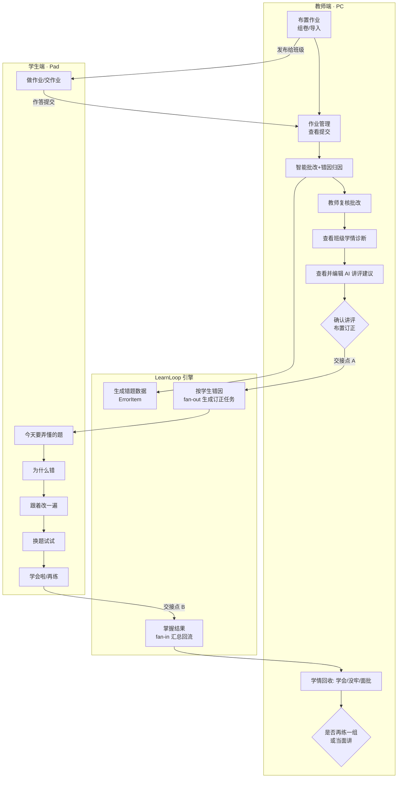

# 真学会 LearnLoop 产品 PRD · V1（框架版）

> 本文档将已对齐的产品定位、双端用户路径与功能整理为可评审、可分配的 PRD，作为后续逐模块细化的基线。  
> 关联文档：[00-文档索引](./00-真学会%20LearnLoop-文档索引.md) · [01-背景预研](./01-真学会%20LearnLoop%20项目背景预研.md) · [02-Loop架构](./02-真学会%20LearnLoop-产品定义与Loop架构说明.md) · [04-UI设计](./04-真学会%20LearnLoop-UI设计文档-V1.md) · [05-数据模型](./05-真学会%20LearnLoop-数据模型与数据元设计-V1.md) · [06-内容域](./06-真学会%20LearnLoop-MVP内容域定义（一次函数）.md) · [07-交付排期](./07-真学会%20LearnLoop-黑客松交付与排期分工.md)  
> 文档类型：正式 PRD（V1 框架版，模块内字段级细节将在后续版本逐步补齐）

---

## 1. 项目背景

中小学作业、小测是最高频的教学评价场景，但一次作业产生的学习事实，往往没有自动转化为老师的教学动作、学生的学习路径和家长的协同建议。现有产品按单点切分（批改、错题本、题库、家校沟通），数据在角色之间不流动，导致「批完 ≠ 学会」。

真学会 LearnLoop 以一次作业为入口，把同一份作业数据转译成老师的讲评、学生的订正补练和家长的协同摘要，让作业从「批完」走向「真学会」。

---

## 2. 项目目标

| 层面 | 目标 |
| --- | --- |
| 用户价值 | 老师知道怎么讲、谁要跟进；学生知道为什么错、怎么订正、是否真会；家长知道怎么配合 |
| 产品差异 | 不做单端工具，跑通「老师诊断 → 学生订正 → 掌握回流」的双端闭环 |
| 本期（黑客松）目标 | 用 **教师 PC + 学生 Pad** 两端，**完整演示**一份作业从「布置 → 作答 → 批改 → 讲评 → 订正 → 回流」的主线，跑通两个交接点 |

---

## 3. 关键名词定义（含内部 / 用户语对照）

界面只出现「用户用语」，「内部概念」仅用于设计与实现，不上界面。

| 内部概念 | 用户用语（界面文案） | 说明 |
| --- | --- | --- |
| LoopInstance | 一份作业 / 一次讲评 | 一次作业的闭环实例 |
| 作业 / Assignment | 作业 / 试卷 | 题目集合 + 标准答案 + 知识点 + 班级 + 截止时间 |
| 作答 / Submission | 作答 / 提交 | 学生对作业的回答（纸质拍照或电子提交） |
| 批改 / Grading | 批改 | AI 判分 + 教师复核 |
| 错因归因 | （生成错题数据） | 批改后判定错因类型、标知识点，产出 ErrorItem |
| 交接点 A（fan-out） | 确认讲评，布置订正 | 老师确认后，按学生错因分发个性化订正任务 |
| 交接点 B（fan-in） | 学情回收 | 学生掌握结果汇总并回流给老师 |
| ErrorItem | 错题 | 贯穿全流程的原子数据（题目/错因/订正/变式/掌握状态） |
| mastery_status | 学会了 / 还没学牢 / 建议面批 | 学生对某错题的掌握状态 |
| 掌握率 / 阈值 | 全班学会率 / 还有 N 人没真学会 | 衡量本次讲评是否有效 |
| 二次干预 | 再练一组 / 当面讲一下 | 未达标时的下一轮动作 |
| 长期记忆 | 学情溯源 / 我的错题本 | 跨作业沉淀的薄弱点与进步 |
| LearnLoop 引擎 | （不展示） | 状态机 + 事件，负责 fan-out / fan-in |

---

## 4. 版本定位

| 项目 | 本期（V1 / 黑客松） |
| --- | --- |
| 商业定位 | B 端进校（学校 / 老师发起，学生家长接入） |
| 落地学科 | 初中数学 · 一次函数（单章节）；**知识点与错因枚举以 [06-MVP 内容域定义](./06-真学会%20LearnLoop-MVP内容域定义（一次函数）.md) 为准** |
| 教师端载体 | PC Web（决策密集，可嵌入校园工作台） |
| 学生端载体 | 学习平板 / Pad Web（手写订正友好） |
| 家长端载体 | 本期仅做教师侧「家长摘要」生成，不做独立家长端 |

---

## 5. 不在本期范围

- 独立家长端（微信小程序 / 公众号推送）→ 后续演进
- 在线题库 / 智能组卷 → 本期用导入 / 预置作业
- 拍照 / 高拍仪 OCR 全链路 → 本期用电子作答或预置数据兜底
- 多学科 / 多章节知识点体系 → 本期单章节写死（枚举见 [06-MVP 内容域定义](./06-真学会%20LearnLoop-MVP内容域定义（一次函数）.md)）
- 自定义知识点 → 本期仅可选用 [06 内容域](./06-真学会%20LearnLoop-MVP内容域定义（一次函数）.md) §1.3 枚举；错因大类仅 5 类，细项描述由 AI 生成
- 教师手机端轻通知 → 后续演进
- 复杂留痕、审批链路、权限体系 → 后续演进

---

## 6. 核心方案

### 6.1 主线：一份作业的接力（完整版）

```text
【作业准备】布置作业 →（学生作答）→ 作业管理（提交进度）→ 智能批改 + 错因归因 → 教师复核
        │  （此阶段生成贯穿全流程的错题数据 ErrorItem）
【备课讲评】老师看学情 → AI 讲评建议 → 老师确认
        │
   ★交接点 A：确认讲评，布置订正（按学生错因分发）
        │
【学生闯关】为什么错 → 跟着改 → 换题试试 → 学会啦
        │
   ★交接点 B：学情回收（掌握结果汇总回流）
        │
【学情回收】谁学会 / 谁没牢 / 谁面批 → 再练一组 / 当面讲
        │
【沉淀】学情溯源（班级薄弱点、学生画像）+ 家长摘要
```

> 上游「作业准备」是产品完整性与 Demo 可信度的**必要环节**（布置 → 作答 → 作业管理 → 批改）。工程上可对题库/OCR/部分学生作答做**数据降级**，但页面链路与状态流转不省略（见 6.5）。

### 6.2 总体流程图（泳道）



### 6.3 流程说明

0a. 老师在「作业布置」组卷或导入作业，标注知识点，发布给班级并设截止。
0b. 学生在 Pad「做作业 / 交作业」完成作答并提交（纸质拍照 / 电子）。
0c. 老师在「**作业管理**」查看提交情况、录入作答（模块名不用「作答回收」）。
0d. 系统「智能批改」自动判分并归因，**生成错题数据 ErrorItem**；老师复核修正。
1. 老师在「备课讲评」看本次作业的班级学情与 AI 讲评建议，可编辑。
2. 老师点「确认讲评，布置订正」（**交接点 A**）→ 引擎按每个学生的错因生成个性化订正任务。
3. 学生在 Pad「今天要弄懂的题」进入闯关：为什么错 → 跟着改 → 换题试试 → 学会啦。
4. 学生完成后，掌握结果经引擎汇总回流（**交接点 B**）。
5. 老师在「学情回收」看谁学会 / 谁没牢 / 谁需面批，决定再练一组或当面讲。
6. 结果沉淀进「学情溯源」与「家长摘要」。

### 6.4 核心逻辑：掌握判定（Loop 关闭条件）

| 判定 | 条件 | 用户用语 |
| --- | --- | --- |
| 学会了 | 变式补练通过 | ✓ 已学会 |
| 还没学牢 | 订正完成但变式未过 | 💪 再练一组 |
| 建议面批 | 订正与变式均未过 | 🙋 当面讲一下 |
| 全班 Loop 关闭 | 学会率 ≥ 阈值（默认 85%） | 还有 N 人没真学会 → 二次干预 |

### 6.5 本期 Demo 简化（降级方案）

| 完整产品 | 本期 Demo 降级 |
| --- | --- |
| 在线组卷 / 题库选题 / 上传拆题 | 三种入口 **UI 完整呈现**；组卷与拆题结果用预置数据兜底 |
| 学生纸质拍照 / 电子作答 | **至少 1 名学生可真实提交**；其余可用预置作答 |
| 全量 AI 批改 + 教师逐题复核 | AI 批改 + 学生维度下钻 + 一键确认（复核简化） |
| 多班级、多作业真实并发 | **信息架构支持「多班级 × 多作业」**；演示数据聚焦 1 个班 + 1 份主作业 |

降级原则（关键）：**区分「信息架构」与「演示数据」。**

- **信息架构不降级**：导航与层级按真实的「多班级 × 多作业」组织；四阶段页统一「列表 → 详情」+ 生命周期流转条（lifeflow）。
- **演示数据降级**：聚焦单班 + 单份主作业 + 3～5 名重点学生；题库/OCR 用预置。
- **工程重心**：完整 10 步主链路可交互（见 [07 §3.1](./07-真学会%20LearnLoop-黑客松交付与排期分工.md)）；两个交接点（fan-out / fan-in）优先于 P2 可视化。

---

## 7. 教师端功能（PC Web）

按老师真实工作时间线组织：作业准备 → 批改 → 讲评 → 回收 → 沉淀。

**两个贯穿全局的上下文维度**（信息架构层面，避免单作业视图造成困惑）：

- **班级**：顶栏可切班级（本期默认初二(3)班，另挂 1–2 个班作上下文）。
- **作业次**：「作业管理」是跨班级 / 作业次的**作业列表中枢**，每条作业带生命周期状态（见 §9.1）。智能批改、备课讲评、学情回收是某份选中作业的**阶段详情视图**，不再各自维护独立列表。

| 模块 | 阶段 | 核心内容 |
| --- | --- | --- |
| 工作台 | 入口 | 班级切换（默认全部班聚合，可切单班联动过滤）· 今日待办（待确认 / 待讲评 / 订正逾期 / 建议面批）· 真学会率健康度 · **进行中作业 Loop 总览（按时间倒序、仅未闭环）** + 查看全部作业入口 |
| 作业布置 | 作业准备 | 三种入口：**题库选题** / **上传拆题（图片 → AI 拆题 → 逐题确认）** / **手动录入** · 标注知识点 · 选班级设截止 · 发布 |
| 作业管理 | 作业准备 | 跨班级 / 作业次的**作业列表 + 生命周期状态**；点击进入该作业当前阶段详情（提交情况 · 录入 / 上传学生作答） |
| 智能批改 | 作业准备 | AI 判分 + 错因归因（生成错题数据）· **班级批改详情 → 学生得分概览 → 单生作答与错因下钻** · 教师复核 + 一键确认 |
| 备课讲评（讲评前） | 讲评 | **历史学情聚合（本班共性弱项 / 趋势）** · 这次答得怎么样 · 大家主要错在这里 · **点击「生成讲评建议」** · 需跟进学生 · 确认布置订正 |
| 学情回收（讲评后） | 回收 | 回收学生「**订正 + 变式**」结果 · 一句话学情总结 · 全班学会情况 · 跟进建议 · 再练一组 |
| 学情溯源（沉淀） | 沉淀 | **跨作业 / 跨时间的唯一沉淀视图**，**两层下钻**：**全部班级**（体检榜 · 共性 vs 个性弱项 · 跨班有效性）→ **单个班级**（真掌握率趋势 · 知识点根因 · 教学有效性 · 重点学生）→ 学生个体（详见 §7.1） |
| 家长摘要 | 沉淀 | 自动生成家长可懂的摘要，确认后群发 |

### 7.1 学情溯源模块详述

**定位**：其余模块（备课讲评 / 学情回收）都是**单次作业**视角；学情溯源是产品里**唯一的跨作业 / 跨时间视图**，把每一次 Loop 的结果沉淀成可追溯的「轨迹 + 结构 + 因果」，是长期价值与数据飞轮的载体。

**它要回答单次视图答不了的三个问题**：① 这个薄弱点**从哪来**（往上游知识点追）② 这个学生**从何时掉队**（往时间追）③ 我的讲评**有没有用**（往教学动作追）。

**差异化**：因为沉淀的是 Loop（错因→订正→变式→真掌握）而非分数，所以能做到常规学情分析做不到的「**证明教学动作有效性**」。

#### 分析流程：从「全部班级」下钻到「单班 / 个人」

学情分析是一个**从面到点、逐层下钻**的漏斗，三层维度回答的问题与分析逻辑各不相同，呈现方式也随之不同：

| 维度 | 回答的核心问题 | 分析逻辑 | 主要呈现 | 落到的行动 |
| --- | --- | --- | --- | --- |
| **L1 全部班级** | 我带的几个班整体如何？精力往哪倾斜？是教法问题还是教材/进度问题？ | **横向对比**（排名 / 共性 vs 个性 / 跨班归因） | 对比条 · 知识点×班级矩阵 | 调整教学计划 / 决定重点跟哪个班 |
| **L2 单个班级** | 这个班一直错什么？根因在哪？讲评有没有用？谁掉队？ | **纵向溯源**（趋势 / 根因 / 有效性 / 分层） | 折线 · 热力地图 · 前后对比条 | 下次讲什么 / 讲法换不换 / 跟哪些学生 |
| **L3 单个学生** | 这个学生卡在哪、怎么帮？ | **个体画像** | 掌握轨迹时间线 | 个性化任务 / 家长摘要 |

> 默认进入 **L1 全部班级**概览，点任一班级下钻到 L2，点学生下钻到 L3；面包屑可逐层返回。若老师只带 1 个班，则 L1 ≡ L2。

#### L1 全部班级 · 看板（对比型，精简 3 块）

| # | 子板块 | 展示内容 | 呈现样式 | 价值 |
| --- | --- | --- | --- | --- |
| L1-A | 班级体检榜 | 各班**真掌握率排名** + 闭环率 + 待提升人数 | 横向对比条 / 排名 | 一眼看出谁拖后腿、精力往哪倾斜 |
| L1-B | 共性 vs 个性弱项 | 知识点 × 班级 掌握**热力矩阵**；全班都弱=共性，单班弱=个性 | 热力矩阵 + 共性/个性标注 | **判断是「教法/教材问题」还是「某班问题」**（L1 独有最高价值） |
| L1-C | 教学有效性跨班对比 | 同一套讲评在各班的**提升幅度对比** | 多班提升幅度条 | 剥离班级基础变量，归因「讲法 vs 班级」 |

#### L2 单个班级 · 看板（溯源型，精简：KPI + 3 块 + 重点学生）

| # | 子板块 | 展示内容 | 呈现样式 | 价值 | 性质 |
| --- | --- | --- | --- | --- | --- |
| 健康度 | 本月真掌握率（环比）/ 闭环率 / 有效讲评率 / 待提升人数 | 顶部数字 | 一行体检 | 常规 |
| L2-① 真掌握率趋势 | **真掌握率 vs 表面正确率**双线 + 讲评点 | 折线 + 讲评标记 | 「批完≠学会」的差 + 班级走向 | 核心 |
| L2-② 知识点薄弱地图（根因） | 知识点掌握热力 + 前置薄弱→下游连环错**根因链** | 热力网格 + 根因箭头 | 弱在哪、**根因在哪** | 核心 |
| L2-③ 教学有效性 | 每次讲评**前后掌握率提升**，标有效/无效 | 前→后对比条 | 讲评**有没有用**（证明 slogan） | 核心 · 独有 |
| L2-④ 重点学生 | 分层分布 + 升降流动 + 掉队学生**掌握轨迹**（合并原板块 5/6），点学生下钻 L3 | 分层条 + 学生轨迹序列 | 谁掉队、落到具体人（可下钻 L3） | 常规+ |

#### L3 单个学生 · 画像（个体型，精简：身份卡 + KPI + 4 块）

从 L2-④ 重点学生点击进入，是把班级问题**落到具体一个人**、并直接接回闭环（布置专属任务 / 家长摘要）的终点页。

| # | 子板块 | 展示内容 | 呈现样式 | 价值 |
| --- | --- | --- | --- | --- |
| 身份卡 | 头像 / 学号 / 班级 / Pad 状态 + 当前真掌握率（环比）+ 班级平均 + 分层标签 | 顶部画像卡 | 一眼看清这个学生当前处境 |
| KPI | 真掌握率 / 订正闭环率 / 反复点数 / 班级排名 | 顶部数字 | 个人体检 |
| L3-① 掌握率轨迹 | **本人真掌握率 vs 班级平均**双线 + 讲评点，看是否掉队 | 折线 + 对比基准线 | 在变好还是掉队（结构性 vs 偶发） |
| L3-② 知识点掌握分布 | 各知识点掌握度（按掌握度着色） | 条形 / 雷达 | 强弱结构、弱在哪 |
| L3-③ 错因构成 | 本人错误按错因大类（概念性 / 审题 / 方法与步骤 / 计算 / 书写与表达）占比 | 环形图 + 图例 | **为什么错**（习惯 vs 能力） |
| L3-④ 逐次作业明细 | 每次作业的得分 / 真掌握率 / 主要错因 / **是否订正闭环** | 横向表格（按作业次） | 横向看每一次，定位掉队的关键节点 |
| 行动 | AI 一句话诊断 + 「布置专属补练」「生成家长摘要」 | 建议卡 + 操作条 | 把诊断直接接回闭环 |

> **精简说明**：原 6 子板块中「错因演变」的"结构性 vs 偶发"判断并入 L2-② 根因 / L2-④ 重点学生；个体画像下沉为独立的 L3 画像页（轨迹 / 知识点 / 错因 / 逐次明细），不在 L2 主界面堆砌。每个维度只保留**最关键的信息**、以可视化为主。
> **边界**：学情回收看**这一次**作业（单个 LoopInstance）；学情溯源看**所有历史次**（全部 Loop 沉淀）。

#### 本期取舍

- **建议必做**：L1-A 体检榜 + L1-B 共性/个性矩阵；L2-① 趋势 + L2-② 知识点根因 + L2-③ 教学有效性；L3 学生画像（至少 1 个掉队学生跑通"画像→布置专属任务"）—— 让评委一眼看到「跨班对比 + 跨时间溯源 + 追根因 + 证明有效 + 落到个人」。
- **可轻**：L1-C 跨班有效性、L2-④ 重点学生用简化卡片；L3 仅完整跑通 1 个学生示例，其余占位。
- **呈现原则**：以**可视化为主**（对比条 / 矩阵 / 趋势线 / 热力），每个维度只保留最关键信息，不堆砌。

---

## 8. 学生端功能（Pad Web）

| 模块 | 阶段 | 核心内容 |
| --- | --- | --- |
| 做作业 / 交作业 | 作答 | 查看老师布置的作业 · 作答并提交（纸质拍照 / 电子） |
| 今天要弄懂的题 | 订正 | 老师布置的订正任务列表 + 鼓励式进度 |
| 闯关（每道题） | 订正 | 为什么错 → 跟着改一遍 → 换题试试 → 学会啦（鼓励反馈） |
| 我的错题本 | 沉淀 | 我攻克的题 / 还要加油的题（掌握沉淀） |

---

## 9. 状态定义

### 9.1 作业 Loop（班级级 HomeworkLoop）

> 下表状态即「作业管理」列表中每条作业的**状态来源**：作业管理是跨班级 / 作业次的总台账，每条带状态 pill；老师点击某条作业，路由到其当前状态对应的阶段详情页。
>
> **四阶段页统一「列表 → 详情」**：作业管理、智能批改、备课讲评、学情回收四个阶段页结构一致——均为「列表页 → 详情页」。作业管理列**全部**作业；其余三页各自列**处于本阶段**的作业（智能批改=待确认、备课讲评=待讲评、学情回收=订正回收中），列表分「待处理（本阶段） / 已流转（已进入下一阶段）」两组，状态 pill 始终反映**当前真实状态**。
>
> **生命周期流转条**：每个阶段详情页顶部固定一条 5 节点流转条「**作业管理** → 智能批改 → 备课讲评 → 订正回收 → 已闭环」，已完成节点打勾、当前节点高亮、后续置灰，统一显示「这份作业到哪一步、上一步谁交来、下一步交给谁」的**状态与流转关系**。
>
> **关键澄清（AI 先判分、老师后把关）**：因为本产品采用「AI 判分 + 错因归因」自动批改，作答一回收，AI 即完成判分。因此原 V1 的「待批改」拆为两态——**待批改**（回收齐、AI 尚未/正在判分，系统态）与 **待确认**（AI 已判分归因，等老师复核确认，是老师的真正动作）。老师在「智能批改」里看到的是**待确认**，而非待批改。

| 状态 | 用户感知（老师视角） | 进入条件 | 推进动作 → 下一状态 | 处理模块 |
| --- | --- | --- | --- | --- |
| 待作答 | 已布置，学生作答中 / 未交齐 | 老师发布作业给班级 | 学生提交齐 / 到截止 → 待批改 | 作业管理（提交情况 · 补录） |
| 待批改 | 作答已回收，待 AI 批改 | 学生作答提交齐 / 到截止 | AI 判分 + 错因归因完成 → 待确认 | 作业管理 → 触发 / 自动批改 |
| 待确认 | **AI 已判分归因，待老师复核确认** | AI 批改完成 | 老师复核 / 改判 + 确认 → 待讲评 | 智能批改（班级批改详情 · 学生下钻） |
| 待讲评 | 错题数据(ErrorItem)就绪，待备课讲评 | 老师确认批改 | 老师讲评 + 布置订正（交接点 A · fan-out）→ 订正回收中 | 备课讲评 |
| 订正回收中 | 已布置订正，学生订正 + 变式作答回收中 | 老师确认布置订正 | 学生完成、系统回收（交接点 B · fan-in）→ 已闭环 / 需二次干预 | 学情回收 |
| 已闭环 | 真学会率达标，Loop 关闭 | 学会率 ≥ 阈值或老师手动关闭 | —（沉淀进错题本 / 学情溯源） | 作业管理（已完成） |
| 需二次干预 | 订正后仍有人没学会 | 学会率 < 阈值 | 老师再讲 / 再订正 → 新一轮 | 学情回收 / 备课讲评 |

### 9.2 学生掌握（学生级 StudentLoop）

`待订正 → 订正完成 → 学会了 / 还没学牢 / 建议面批`

---

## 10. 风险与约束

| 风险 | 说明 | 应对 |
| --- | --- | --- |
| 手写数学录入 | 数学订正需手写，键盘输入不可用 | 本期用电子作答 / 选择填空兜底，OCR 后续做 |
| 未成年人合规 | C 端学生 App 审批严格 | B 端进校 + 校内平板使用 |
| 设备现实 | 学生未必人手一台 Pad | 兼容班级大屏 / 家庭共用，降级路径后续补 |
| 错因归因质量 | 错因判断是闭环地基 | 大类 5 类封闭枚举 + AI 生成描述，见 [06 内容域](./06-真学会%20LearnLoop-MVP内容域定义（一次函数）.md) |
| Demo 时间 | 黑客松周期短 | 优先跑通主线 P0，增强项后置 |

---

## 11. 需求清单

| 需求ID | 模块 | 需求名称 | 需求描述 | 优先级 | 负责人 | 状态 | 验收要点 |
| --- | --- | --- | --- | --- | --- | --- | --- |
| R-001 | 工作台 | 今日待办看板 | 展示待批改、待讲评、未学会人数、建议面批，点击进入对应模块 | P1 | | 原型已实现 | 各类待办可点击跳转；数字与实际数据一致 |
| R-024 | 作业布置 | 作业布置与发布 | 组卷或导入题目，选班级、设截止，发布作业 | **P0** | | 原型已实现 | 能创建一份作业并发布给班级 |
| R-025 | 作业布置 | 题目结构化 | 题目、标准答案、知识点标注（可导入带入） | P0 | | 原型已实现 | 每题有标准答案与知识点标签（本期可预置） |
| R-026 | 学生作答 | 学生作答与提交 | 学生查看作业、作答并提交（拍照/电子） | **P0** | | 原型已实现 | 学生可提交作答；教师侧可见提交状态 |
| R-027 | 作业管理 | 作业列表与提交管理 | 查看提交情况，录入/上传学生作答；跨作业列表与状态 pill | **P0** | | 原型已实现 | 可查看提交进度；作答进入待批改 |
| R-028 | 智能批改 | 智能批改与错因归因 | 调用批改能力判分并归因，生成 ErrorItem | P0 | | 原型已实现（UI） | 输出判分 + 错因大类 + 错因描述 + 知识点 |
| R-029 | 智能批改 | 教师批改复核 | 老师修正 AI 判分/错因，确认后进入讲评 | P1 | | 原型已实现 | 可修正批改结果；确认后状态转待讲评 |
| R-002 | 备课讲评 | 作业接入 | 从已批改作业进入诊断，定位 LoopInstance | P0 | | 原型已实现 | 能从一份已批改作业进入诊断 |
| R-003 | 备课讲评 | 班级学情诊断展示 | 展示提交率、均分、高频错题、错因聚类 | P0 | | 原型已实现 | 错题按错误率排序；每题显示主要错因 |
| R-004 | 备课讲评 | AI 讲评建议 | 生成推荐讲评顺序与重点，老师可编辑 | P0 | | 原型已实现 | 给出讲/不讲建议；可编辑后保存 |
| R-005 | 备课讲评 | 需跟进学生分层 | 按错因列出需单独跟进学生 | P1 | | 原型已实现 | 学生按错因分组；与诊断口径一致 |
| R-006 | 备课讲评 | 确认讲评并布置订正（交接点 A） | 老师确认后触发按学生错因 fan-out 生成订正任务 | P0 | | 原型已实现 | 点击后生成各学生任务；任务来自本次错因 |
| R-007 | 学情回收 | 订正结果汇总（交接点 B） | 汇总学生掌握结果并回流，更新 Loop 状态 | P0 | | 原型已实现 | 学生完成后教师侧可见；状态正确流转 |
| R-008 | 学情回收 | 全班学会情况展示 | 展示学会 / 没牢 / 面批人数与学会率 | P0 | | 原型已实现 | 三类人数+学会率；与判定规则一致 |
| R-009 | 学情回收 | 跟进建议与二次干预 | 生成再练一组 / 面批名单，可一键再布置 | P1 | | 原型已实现 | 未达标自动给建议；可再布置一组 |
| R-010 | 学情溯源 | 知识点薄弱地图（根因） | 跨作业统计知识点掌握热力，标出前置薄弱→下游连环错的根因链路 | P2 | | 原型已升级 | 热力可视化；能展示根因链路（L2-②） |
| R-011 | 学情溯源 | 学生个体画像（L3） | 单生掌握率轨迹(vs 班级) + 知识点分布 + 错因构成 + 逐次作业明细 + 行动入口 | P2 | | 原型已实现 | 可从 L2-④ 下钻；含轨迹/知识点/错因/逐次明细四块 |
| R-038 | 学情溯源 | 班级真掌握率趋势 | 真掌握率 vs 表面正确率双线 + 讲评点 + 健康度 KPI | P2 | | 原型已升级 | 折线 + 讲评点标记；环比数字（L2-①） |
| R-039 | 学情溯源 | 教学有效性分析 | 计算每次讲评/订正前后掌握率提升，标有效/无效讲评 | P2 | | 原型已升级 | 前后对比可视化；标无效讲法（L2-③，差异化亮点） |
| R-040 | 学情溯源 | 错因演变趋势 | 各错因类型随时间收敛/反复，区分已解决与结构性 | P3 | | 本期合并 | 已并入 L2-②根因 / L2-④重点学生，不单列 |
| R-041 | 学情溯源 | 学生分层与流动 | 分层分布 + 跨次升降流动 + 掉队预警，合并入 L2-④ 重点学生 | P2 | | 原型已升级 | 分层条 + 升降名单 + 掉队学生轨迹（L2-④） |
| R-042 | 学情溯源 | 全部班级体检榜（L1-A） | 各班真掌握率排名 + 闭环率 + 待提升人数，可点击下钻单班 | P2 | | 原型已实现 | 横向对比条 / 排名；点班级进 L2 |
| R-043 | 学情溯源 | 共性 vs 个性弱项矩阵（L1-B） | 知识点×班级掌握热力矩阵，标共性弱项（全班弱）/个性弱项（单班弱） | P2 | | 原型已实现 | 热力矩阵 + 共性/个性标注（L1 核心价值） |
| R-044 | 学情溯源 | 教学有效性跨班对比（L1-C） | 同一套讲评在各班的提升幅度对比，归因讲法 vs 班级基础 | P2 | | 原型已实现 | 多班提升幅度条对比 |
| R-045 | 学情溯源 | 维度下钻与面包屑 | 全部班级 ↔ 单个班级 ↔ 学生 三层切换与逐层返回 | P2 | | 原型已实现 | 默认 L1 概览，可下钻/返回；面包屑 全部班级 ▸ 班级 ▸ 学生 |
| R-046 | 学情溯源 | 学生画像接回闭环 | L3 画像页可「布置专属补练」「生成家长摘要」，把诊断接回 fan-out | P2 | | 原型已实现 | 画像底部操作条触发个性化任务 / 家长摘要 |
| R-012 | 家长摘要 | 家长摘要生成 | 基于订正结果生成家长可懂摘要 | P1 | | 原型已实现 | 含问题/好消息/不建议做/怎么配合 |
| R-013 | 学生闯关 | 订正任务首页 | 展示老师布置的订正任务与进度 | P0 | | 原型已实现 | 列出本次订正题；显示完成进度 |
| R-014 | 学生闯关 | 错因讲解（为什么错） | 针对学生个人作答给出错因讲解 | P0 | | 原型已实现 | 讲解针对个人错因，非通用解析 |
| R-015 | 学生闯关 | 分步订正（跟着改） | 分步引导订正，支持手写/拍照（本期可简化） | P0 | | 原型已实现 | 给出分步引导；可记录订正 |
| R-016 | 学生闯关 | 变式验证与掌握判定 | 出变式题，按对错判定掌握状态 | P0 | | 原型已实现 | 变式作答后给出学会/没牢判定 |
| R-017 | 学生闯关 | 学会结果反馈 | 给出鼓励式掌握结果，结果回流 | P0 | | 原型已实现 | 显示学会结果；触发交接点 B |
| R-018 | 我的错题本 | 错题与掌握沉淀 | 展示已攻克 / 待加油的题 | P2 | | 原型已实现 | 区分已学会与待加强 |
| R-019 | 平台 | LearnLoop 引擎 | 状态机 + 事件，实现 fan-out / fan-in | P0 | | 待开发 | 两个交接点事件可驱动状态流转 |
| R-020 | 平台 | 共享数据底座 | ErrorItem / HomeworkLoop / StudentLoop 数据模型 | P0 | | 待开发 | 三端读写同一份数据 |
| R-021 | 能力 | 批改与错因归因 | 对作答判分、归类错因大类、生成错因描述、标知识点 | P0 | | 待开发 | 输出 `error_cause_category`（五选一）+ `cause_description` + `kp_id` |
| R-022 | 能力 | 变式题生成 | 按错因生成同类变式题 | P0 | | 待开发 | 变式与原错因同知识点 |
| R-023 | 能力 | 掌握判定规则 | 定义学会/没牢/面批与学会率阈值 | P0 | | 待开发 | 判定规则可配置；与展示口径一致 |
| R-030 | 作业管理 | 作业列表与状态管理 | 跨班级 / 作业次的作业列表，按生命周期状态组织，点击进入对应阶段详情 | P1 | | 原型已实现 | 列表含状态 pill；点击路由到当前阶段详情 |
| R-031 | 平台 | 多班级与作业次维度 | 支持按班级切换、按作业次组织数据，作为全局上下文 | P1 | | 原型已实现 | 可切班级；作业按次序列展示 |
| R-032 | 作业布置 | 题库选题组卷 | 按知识点 / 难度筛选题库题目，勾选入卷 | P2 | | 原型已实现（UI） | 可筛选并勾选入卷（本期预置题库） |
| R-033 | 作业布置 | 上传拆题与确认 | 上传图片 / 文档 → AI 自动拆题 → 逐题确认题干 / 答案 / 知识点 | P2 | | 原型已实现（UI） | 拆题结果可逐题确认编辑（本期预置兜底） |
| R-034 | 智能批改 | 学生维度下钻 | 班级批改详情 → 学生得分概览 → 单生作答与错因详情 | P1 | | 原型已实现 | 可下钻到单个学生的作答与错因 |
| R-035 | 备课讲评 | 历史学情聚合 | 结合过去一段时间作业，给出本班共性弱项与趋势描述 | P1 | | 原型已实现 | 展示跨作业关联（如「第 N 次弱项」） |
| R-036 | 备课讲评 | 讲评建议按需生成 | 老师点击触发 AI 生成讲评建议，可重新生成 / 编辑 | P1 | | 原型已实现 | 点击生成；可编辑保存 |
| R-037 | 学情溯源 | 学生横向学情序列 | 展示单个学生跨多次作业的错因序列与掌握趋势（并入 L3-④ 逐次明细） | P2 | | 原型已实现 | 已由 L3-④ 逐次作业明细表覆盖 |

---

## 12. 里程碑

| 阶段 | 里程碑 | 计划时间 | 关联需求 | 关键交付物 | 完成标准 | 状态 |
| --- | --- | --- | --- | --- | --- | --- |
| M0 | 范围冻结 | 6.24 | — | P0 清单、API 草案、Demo 数据表 | 全员对齐 [07](./07-真学会%20LearnLoop-黑客松交付与排期分工.md) | 进行中 |
| M1 | PRD / 原型评审通过 | 6.24 | — | 本 PRD、原型、06 内容域 | 主线、命名、范围评审闭环 | 进行中 |
| M2 | 数据底座与引擎 | 6.24–25 | R-019、R-020、R-023 | 数据模型、状态机、判定规则 | 两个交接点事件可驱动状态流转 | 未开始 |
| M3 | 批改前链路 + 批改 | 6.25–26 | R-024～R-029、R-021、R-028 | 布置/作答/作业管理/批改 API | 一份作业可产出 ErrorItem | 未开始 |
| M4 | 教师端备课讲评（含交接点 A） | 6.26 | R-002、R-003、R-004、R-006 | 备课讲评页 + fan-out | 老师确认并布置订正 | 未开始 |
| M5 | 学生端闯关（学习闭环） | 6.26–27 | R-013～R-017、R-022 | 学生 Pad 闯关流程 | 学生走完为什么错→学会啦 | 未开始 |
| M6 | 学情回收（含交接点 B） | 6.27 | R-007、R-008 | 学情回收页 | 掌握结果回流，教师可见学会率 | 未开始 |
| M7 | 端到端 Demo 联调 | 6.27 | P0 全量 | 可演示 Demo | **10 步主链路**可交互（含批改前） | 未开始 |
| M8 | 增强模块 | 6.28 | R-001、R-005、R-009、R-012 等 P1 | 工作台/家长摘要等 | 增强项可用，不阻塞主线 | 未开始 |
| M9 | 学情溯源（三层下钻） | — | R-042～R-046 等 P2 | 学情溯源看板 | 原型已实现；评审加分，不阻塞联调 | 原型已实现 |

---

## 13. 一句话总结

真学会 LearnLoop V1 用教师 PC + 学生 Pad 两端，覆盖「布置作业 → 作答 → 批改归因 → 备课讲评 → 布置订正 → 学生闯关 → 学情回收 → 沉淀」的完整作业闭环；本期 Demo 上游可用预置数据降级，核心是跑通批改归因与两个交接点（fan-out 分发 / fan-in 回流），让一份作业真正从「批完」走向「真学会」。
