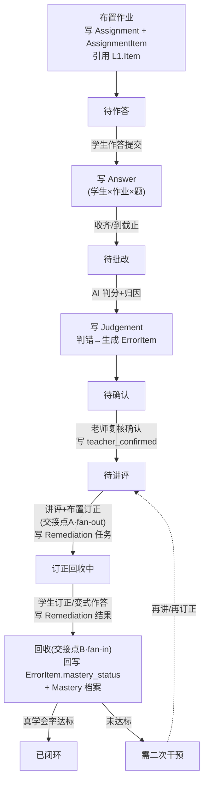

# 真学会 LearnLoop · 数据模型与数据元设计 V1

> 配套文档：`02-产品定义与 Loop 架构说明`（概念）、`03-产品 PRD`（功能与状态机）、`04-UI 设计文档`（页面）。
> 本文是上述文档在**数据层**的落地，供产品经理理清概念、与研发 / 算法 / 数据同学对齐，以及绘制产品架构图对外展示。

---

## 0. 文档目的

| 用途 | 怎么用本文 |
| --- | --- |
| 理清概念 | 第 1 章分层 + 第 3/4 章数据元字段表，把「作业 / 作答 / 批改 / 错题 / 订正 / 掌握」彻底区分开 |
| 对齐协同 | ER 图（第 2 章）+ 字段表，是研发建表、算法对接、前端定义接口的共同语言 |
| 对外展示 | 第 2 章 ER 图、第 6 章数据流转图可直接放进产品架构 PPT |
| 收敛分歧 | 第 8 章「关键设计决策」记录三个岔路的结论与理由，避免反复 |

---

## 1. 设计原则与分层

### 1.1 两条主线决定数据结构

产品本质是 **Dual Loop**（教学闭环 + 学习闭环），数据必须支撑两件事：
1. **一次作业能从「批完」走到「真学会」** —— 需要记录每个事件（作答、批改、订正、掌握）。
2. **跨作业能看错因是否反复、讲评是否有效** —— 需要稳定的主数据（学生、知识点、错因）作为分析维度。

因此采用 **两层 + 一个分析派生层** 的结构：

| 层 | 定位 | 特征 | 包含数据元 |
| --- | --- | --- | --- |
| **L1 基座 / 主数据** | 相对稳定的「资产」与「档案」 | 可跨作业复用、变化慢、是分析的**维度** | 题目 Item · 知识点 KnowledgePoint · 错因大类 ErrorCauseCategory · 教师 Teacher · 班级 Class · 学生 Student |
| **L2 业务 / 事务数据** | 一次次作业产生的「事件流水」 | 随 Loop 不断新增、是分析的**事实** | 作业 Assignment · 作答 Answer · 批改 Judgement · 错题 ErrorItem · 订正与变式 Remediation · 掌握 Mastery |
| **L3 分析派生层** | 由 L2 聚合出的指标视图 | 物化视图 / 实时计算，不手工录入 | 班级错因分布 · 真学会率 · 知识点掌握趋势 |

> 类比数仓的**维度 / 事实**：L1 是维度表（who / what），L2 是事实表（when / how）。所有报表都是「事实 × 维度」的切片。

### 1.2 一个原子贯穿全线：ErrorItem

承接 `02 文档 §6.3`：**错题项 `ErrorItem` 是贯穿主线的原子对象**，一个对象、三种视图——
- 班级级 = ErrorItem 的**聚合视图**（备课讲评）
- 学生级 = ErrorItem 的**分发视图**（订正任务）
- 长期记忆 = ErrorItem 的**历史流水**（错题本 / 学情溯源）

在数据模型里，ErrorItem 是「判错的 Answer + 错因归因 + 订正变式 + 掌握状态」的业务封装，是 L2 的核心枢纽。

---

## 2. 全局 ER 图

```mermaid
erDiagram
    %% ===== L1 基座 / 主数据 =====
    KNOWLEDGE_POINT ||--o{ KNOWLEDGE_POINT : "上级/下级(树)"
    ITEM }o--o{ KNOWLEDGE_POINT : "考查(ItemKnowledge)"
    ITEM ||--o{ ITEM : "变式派生(parent)"
    ERROR_CAUSE_CATEGORY ||--o{ JUDGEMENT : "大类"
    TEACHER ||--o{ CLASS : "任教"
    CLASS ||--o{ STUDENT : "包含"

    %% ===== L2 业务 / 事务数据 =====
    CLASS ||--o{ ASSIGNMENT : "布置给"
    ASSIGNMENT }o--o{ ITEM : "选题(AssignmentItem)"
    ASSIGNMENT ||--o{ ANSWER : "产生作答"
    STUDENT ||--o{ ANSWER : "作答"
    ITEM ||--o{ ANSWER : "针对"
    ANSWER ||--|| JUDGEMENT : "被批改为"
    JUDGEMENT ||--o| ERROR_ITEM : "判错则生成"
    ERROR_ITEM }o--|| KNOWLEDGE_POINT : "归属知识点"
    ERROR_ITEM }o--|| ERROR_CAUSE_CATEGORY : "大类"
    ERROR_ITEM ||--o{ REMEDIATION : "订正/变式任务"
    REMEDIATION }o--o| ITEM : "变式题指向"
    STUDENT ||--o{ MASTERY : "掌握档案"
    KNOWLEDGE_POINT ||--o{ MASTERY : "按知识点"
    ERROR_ITEM ||--o{ MASTERY : "回写更新"
```

> 读图提示：**左上是资产（题/知识点/错因），右上是组织（师/班/生）**；中下是一次作业的事件流水 `作业 → 作答 → 批改 → 错题 → 订正 → 掌握`，最终回写到学生的 `掌握档案 Mastery`，形成闭环。

---

## 3. L1 基座 / 主数据 数据元

### 3.1 题目 Item（内容资产，可复用）

| 字段 | 说明 | 引用 / 取值 |
| --- | --- | --- |
| item_id | 主键 | PK |
| subject | 科目 | 数学 / 物理 … |
| type | 题型 | 选择 / 填空 / 解答 / 判断 |
| stem | 题干 | 文本 + 图片 |
| options | 选项 | 选择题用 |
| standard_answer | 标准答案 | |
| standard_solution | 标准解析 | 用于错因讲解 |
| difficulty | 难度 | 易 / 中 / 难 |
| source | 来源 | 题库 / 拍照拆题 / 手动录入 |
| parent_item_id | 派生自哪道题 | → Item（变式题指向原题，可空） |
| knowledge_points | 考查知识点 | 多对多 → ItemKnowledge（仅引用 [06 内容域](./06-真学会%20LearnLoop-MVP内容域定义（一次函数）.md) §1.3 叶子枚举） |

**关联表 ItemKnowledge**：`item_id` + `kp_id` + `weight`（一题可挂多个知识点）。

### 3.2 知识点 KnowledgePoint（分析维度的核心）

| 字段 | 说明 |
| --- | --- |
| kp_id | 主键 |
| name | 名称 |
| short_name | 简称（UI 标签，≤8 字） |
| subject_id · grade_id · chapter_id | 归属（见 [06 内容域 §1.1](./06-真学会%20LearnLoop-MVP内容域定义（一次函数）.md)） |
| parent_kp_id | 上级知识点（构成知识树） |
| order | 章节内排序 |
| is_taggable | 是否可挂题（仅叶子为 true） |
| prerequisite_kp_ids | 前置知识点（薄弱溯源用，可空） |

### 3.3 错因大类 ErrorCauseCategory（封闭枚举，全产品 5 条）

> **不做错因细项枚举**。题级/人级错因描述由 AI 生成 `cause_description` 自然语言；统计与分组只 rollup 到大类。定义见 [06 内容域 §2](./06-真学会%20LearnLoop-MVP内容域定义（一次函数）.md)。

| 字段 | 说明 |
| --- | --- |
| category | 主键（`CAT-CONCEPT` / `CAT-READING` / `CAT-METHOD` / `CAT-CALC` / `CAT-EXPRESS`） |
| name | 展示名（概念性 / 审题 / 方法与步骤 / 计算 / 书写与表达） |
| description | 大类释义与判例边界 |

### 3.4 组织主数据：Teacher / Class / Student

| 数据元 | 关键字段 |
| --- | --- |
| Teacher 教师 | teacher_id · name · subject |
| Class 班级 | class_id · name（初二(3)班）· grade · subject · teacher_id · student_count |
| Student 学生 | student_id · name · no（学号）· class_id · pad_status（设备激活状态） |

> V1 中 `班级—学生` 为一对多。若后续出现走班 / 跨班，再引入 `Enrollment（报名/在册）` 关联表，本期不做。

---

## 4. L2 业务 / 事务数据 数据元

### 4.1 作业 Assignment（班级级 HomeworkLoop 的载体）

| 字段 | 说明 | 引用 / 取值 |
| --- | --- | --- |
| assignment_id | 主键 | PK |
| title | 作业名（一次函数·课后作业） | |
| seq_no | 作业次（第 12 次） | 学情序列排序用 |
| class_id | 发给哪个班 | → Class |
| items | 题目集合（有序、含分值） | 多对多 → AssignmentItem |
| assign_method | 作答方式 | Pad 电子 / 纸质拍照 |
| deadline | 截止时间 | |
| **status** | **HomeworkLoop 状态** | 待作答 / 待批改 / 待确认 / 待讲评 / 订正回收中 / 已闭环 / 需二次干预 |
| published_at / created_by | 发布时间 / 创建教师 | |
| *（派生）submit_rate / avg_score / learn_rate* | 提交率 / 均分 / 真学会率 | 由 L3 聚合，可缓存 |

**关联表 AssignmentItem**：`assignment_id` + `item_id` + `order`（题序）+ `score`（本次分值）。

> 状态取值与推进动作详见 `03 PRD §9.1`。状态是作业管理列表里每条 pill 的来源，也决定点击后路由到哪个阶段详情页。

### 4.2 作答 Answer（核心事实表，粒度 = 学生 × 作业 × 题）

| 字段 | 说明 | 引用 |
| --- | --- | --- |
| answer_id | 主键 | PK |
| assignment_id / student_id / item_id | 三外键，定义粒度 | → Assignment / Student / Item |
| raw_response | 原始作答（选项 / 手写图 / 文本） | |
| ocr_text | OCR 识别文本 | 纸质拍照时 |
| source | 作答来源 | Pad / 拍照 / 教师补录 |
| submitted_at | 提交时间 | |

> **这是整个分析体系的最细粒度事实**：所有报表（题正确率、班级均分、知识点掌握）都从 Answer 向上聚合。

### 4.3 批改 Judgement（对每条 Answer 的判定）

| 字段 | 说明 | 引用 |
| --- | --- | --- |
| judgement_id | 主键 | PK |
| answer_id | 对应作答（1:1） | → Answer |
| is_correct | 对 / 错 / 半对 | |
| score | 得分 | |
| ai_verdict | AI 判定结果 | 算法写入 |
| confidence | AI 置信度 | 低置信度提示老师重点复核 |
| error_cause_category | 错因大类（错时，五选一） | → ErrorCauseCategory |
| cause_description | 错因描述（AI 生成，老师可改） | 自然语言 |
| hit_kp_ids | 命中知识点 | → KnowledgePoint |
| teacher_confirmed | 老师是否复核确认 / 改判 | 待确认 → 待讲评 的闸门 |
| judged_at | 批改时间 | |

> 拆开 Answer 与 Judgement，是为了清晰表达「**AI 先判（写 ai_verdict）、老师后把关（写 teacher_confirmed）**」这条产品主张；物理实现可合表，逻辑上需区分。

### 4.4 错题 ErrorItem（贯穿主线的原子 · 枢纽）

| 字段 | 说明 | 引用 |
| --- | --- | --- |
| error_item_id | 主键 | PK |
| student_id / assignment_id / item_id | 来源（判错的那条作答） | |
| kp_id | 主知识点 | → KnowledgePoint |
| error_cause_category | 错因大类 | → ErrorCauseCategory |
| cause_description | 错因描述 | 从 Judgement 复制，订正讲解用 |
| **mastery_status** | **掌握状态（StudentLoop）** | 待订正 / 订正完成 / 学会了 / 还没学牢 / 建议面批 |
| remediations | 关联订正/变式任务 | 一对多 → Remediation |
| created_at / closed_at | 生成 / 关闭时间 | |

> ErrorItem = `Judgement(is_correct=false)` 的**业务视图** + 后续订正与掌握状态的**载体**。它就是 `02 文档` 里那个「六种形态」的原子对象。

### 4.5 订正与变式 Remediation（学习闭环的验证事实）

| 字段 | 说明 | 引用 |
| --- | --- | --- |
| remediation_id | 主键 | PK |
| error_item_id | 属于哪道错题 | → ErrorItem |
| type | 类型 | 订正原题 / 变式题 |
| variant_item_id | 变式题指向的题目 | → Item（变式时；变式题本身入题库可复用） |
| student_response | 学生作答 | |
| is_mastered | 判定结果（会 / 不会） | 写回 ErrorItem.mastery_status |
| completed_at | 完成时间 | |

### 4.6 掌握 Mastery（学生 × 知识点的长期档案 · StudentLoop 长期记忆）

| 字段 | 说明 | 引用 |
| --- | --- | --- |
| mastery_id | 主键 | PK |
| student_id / kp_id | 粒度 = 学生 × 知识点 | → Student / KnowledgePoint |
| status | 掌握状态 | 未学 / 学习中 / 已掌握 / 不稳（反复错） |
| score | 掌握度 0–100 | |
| last_updated | 最近更新 | 由 ErrorItem / Remediation 结果回写 |
| source_error_items | 来源错题序列 | 跨作业追踪，可派生 |

---

## 5. L3 分析派生层（由 L2 聚合，不手工录入）

| 派生视图 | 聚合自 | 粒度 | 服务页面 |
| --- | --- | --- | --- |
| 班级错因分布 | Judgement + ErrorItem | 班级 × 错因 | 智能批改 / 备课讲评 |
| 题目正确率 | Answer + Judgement | 作业 × 题 | 智能批改 |
| 真学会率 | Remediation + Mastery | 作业 / 班级 | 工作台健康度 · 学情回收 |
| 知识点掌握趋势 | Mastery 时间序列 | 学生 / 班级 × 知识点 × 时间 | 学情溯源 |
| 学生学情序列 | Assignment + ErrorItem | 学生 × 作业次 | 学生学情下钻 |

---

## 6. 数据随 Loop 的流转（读写时序）

每个状态推进，对应一组数据元的写入。下图把 `PRD §9.1 状态机` 翻译成「写了哪些表」：



**两个关键交接点（数据形态转换处）：**
- **交接点 A · fan-out**：1 份班级诊断（ErrorItem 聚合）→ N 个学生订正任务（Remediation 分发）。
- **交接点 B · fan-in**：N 个学生掌握结果（Remediation）→ 1 张班级复盘（回写 Mastery + 真学会率）。

---

## 7. 聚合分析视图映射（切片 → 页面）

| 切片维度 | 对应页面 / 模块 | 主要读取的数据元 |
| --- | --- | --- |
| 全部班级今日聚合 | 工作台 | Assignment.status + L3 真学会率 |
| 单次作业 × 全班 | 作业管理 / 智能批改 | Answer + Judgement |
| 单次作业 × 单题 | 智能批改（题目正确率） | Answer + Judgement |
| 单次作业 × 单生 | 学生作业下钻 | Answer + Judgement + ErrorItem |
| 班级 × 错因 | 备课讲评 | ErrorItem 聚合 |
| 学生 × 作业次（时间序列） | 学情溯源 / 学生学情 | ErrorItem + Mastery |
| 学生 × 知识点 | 错题本 / 掌握档案 | Mastery |

> 一句话：**同一份 Answer / ErrorItem，按不同维度切片，就长成了不同页面。** 这也是「不重复造数据、一份数据多视图」的架构主张。

---

## 8. 关键设计决策（三个岔路的结论）

> 这些是上一轮讨论中悬而未决的点，本文给出 V1 结论与理由，便于对齐；如需调整可在评审时拍板。

### 决策一：作业要不要拆「模板 vs 实例」？

- **结论（V1）**：**不拆**。`Assignment` 同时承担「组了哪些题」和「发布给某班的实例」两个角色。
- **理由**：黑客松 / V1 单班单次为主，拆模板增加复杂度无收益。
- **演进**：当出现「同一套题发给多个班 / 多个学期复用」时，再抽出 `AssignmentTemplate（组卷模板）`，`Assignment` 退化为引用模板的发布实例。已为此预留 `AssignmentItem` 关联表，演进成本低。

### 决策二：变式题怎么落？

- **结论**：**变式题是一道新的 `Item`**（`parent_item_id` 指向原题），入题库可复用；「给某个学生出的这道变式」是业务实例，记录在 `Remediation.variant_item_id`。
- **理由**：区分「题目资产（L1）」与「某次作答事件（L2）」，避免变式题污染主数据，也让好变式题能沉淀复用。

### 决策三：错因体系怎么建？

- **结论**：**5 个大类封闭枚举**（`ErrorCauseCategory`）+ **AI 按题生成 `cause_description`**；不建细项字典，不在 Item 上预挂典型错因。
- **理由**：大类足够支撑聚合、分组与跨作业趋势；细项文案因题因人而异，由 AI 生成更灵活，老师复核时可改文案或改大类。

---

## 9. 与需求 / 概念的映射速查

| 概念（02/03 文档） | 对应数据元 |
| --- | --- |
| HomeworkLoop（作业 Loop） | Assignment（含 status 状态机） |
| StudentLoop（学生掌握 Loop） | ErrorItem.mastery_status + Mastery |
| ErrorItem 六种形态 | ErrorItem（① 生成 ② 聚合 ③ 分发 ④ 学习 ⑤ 判定 ⑥ 沉淀） |
| AI 先判、老师把关 | Judgement.ai_verdict / teacher_confirmed |
| 真学会率 | L3 派生：Remediation + Mastery |
| 三端同一份数据 | 教师 PC / 学生 Pad / 家长摘要 读写同一 L2 事实 |

---

> 配套：00 文档索引 · 01 背景预研 · 02 产品定义 · 03 PRD · 04 UI 设计 · **[06 MVP 内容域定义](./06-真学会%20LearnLoop-MVP内容域定义（一次函数）.md)** · [07 交付排期](./07-真学会%20LearnLoop-黑客松交付与排期分工.md)
